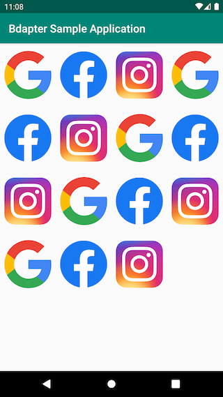
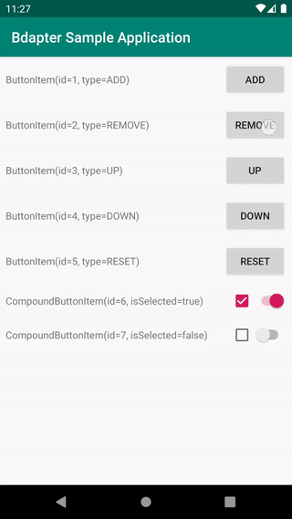
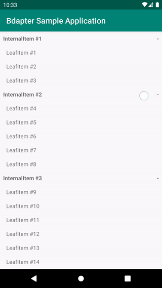
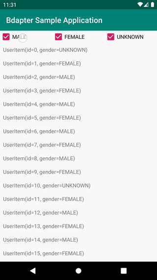
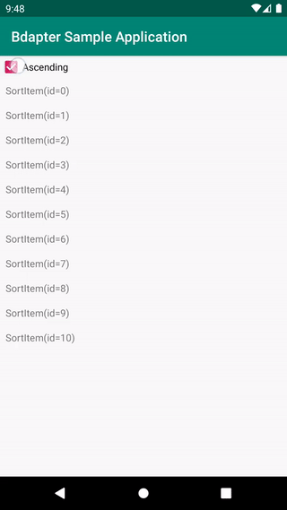
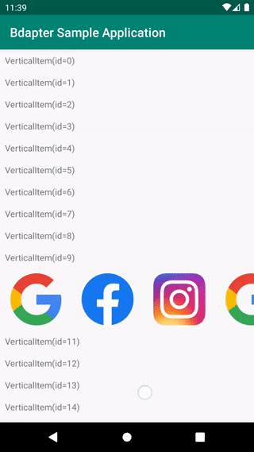
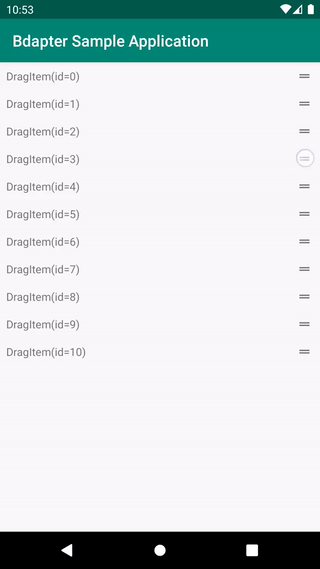
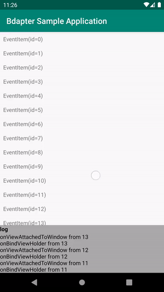

# welcome to bdapter!
Hello! ***bdapter*** is made for developers who are tired of coding `RecyclerView.Adapter` and `RecyclerView.ViewHolder`.

With ***bdapter*** You can use `RecyclerView` without implementation of `RecyclerView.Adapter` and `RecyclerView.ViewHolder` anymore, Also multiple viewHolder is works fine.

And, ***bdapter*** supports `DataBinding` and `MVVM`.

# samples
 |  | 
:---: | :---: | :---:
[multiple viewHolder](https://github.com/quartack/bdapter_sample/tree/main/app/src/main/java/com/quartack/bdapter/sample/basic) | [any layoutManager](https://github.com/quartack/bdapter_sample/tree/main/app/src/main/java/com/quartack/bdapter/sample/grid) | [update items](https://github.com/quartack/bdapter_sample/tree/main/app/src/main/java/com/quartack/bdapter/sample/update)

 |  | 
:---: | :---: | :---:
[tree](https://github.com/quartack/bdapter_sample/tree/main/app/src/main/java/com/quartack/bdapter/sample/tree) | [filter](https://github.com/quartack/bdapter_sample/tree/main/app/src/main/java/com/quartack/bdapter/sample/filter) | [sort](https://github.com/quartack/bdapter_sample/tree/main/app/src/main/java/com/quartack/bdapter/sample/sort)

 |  | 
:---: | :---: | :---:
[recyclerView inside recyclerView](https://github.com/quartack/bdapter_sample/tree/main/app/src/main/java/com/quartack/bdapter/sample/recycler_inside_recycler) | [drag](https://github.com/quartack/bdapter_sample/tree/main/app/src/main/java/com/quartack/bdapter/sample/drag) | [event](https://github.com/quartack/bdapter_sample/tree/main/app/src/main/java/com/quartack/bdapter/sample/event)

# download
[](https://jitpack.io/#quartack/bdapter)
```
repositories {
    maven { url 'https://jitpack.io' }}
}
dependencies {
    implementation "com.github.quartack.bdapter:bdapter:0.9.3"
    kapt "com.github.quartack.bdapter:generator:0.9.3"
}
```
# how to use
## model
**MyModel.kt**
```kotlin
@Keep
@bdapterViewHolder(
    dataBinding = ViewholderMyModelBinding::class,
    viewModelClass = MyViewModel::class
)
data class MyModel(
    val id: Int
)
```
Add `@Keep` and `@bdapterViewHolder` annotations in your model class.
If you are using ProGuard's rule, `@Keep` can be omitted.

## view holder - layout
**viewholder_my_model.xml**
```xml
<?xml version="1.0" encoding="utf-8"?>
<layout xmlns:android="http://schemas.android.com/apk/res/android">
    <data>
        <variable
            name="item"
            type="com.your.package.MyModel" />
        <variable
            name="viewModel"
            type="com.your.package.MyViewModel" />
    </data>
    <TextView
        android:layout_width="match_parent"
        android:layout_height="wrap_content"
        android:text='@{item.toString()}' />
</layout>
```
Written in general `DataBinding` style.

## view model
**MyViewModel.kt**
```kotlin
class MyViewModel : ViewModel() {
    private val _items = MutableLiveData<List<Any>>().apply {
        value = listOf(
            MyModel(1), MyModel(2), MyModel(3)
        )
    }
    val items: LiveData<List<Any>>
        get() = _items
}
```
Create `items` it will be the source of RecyclerView.

***bdapter*** will update the RecyclerView if the value of the `items` changed. 👏

## activity - layout
**activity_main.xml**
```xml
<?xml version="1.0" encoding="utf-8"?>
<layout
    xmlns:android="http://schemas.android.com/apk/res/android"
    xmlns:app="http://schemas.android.com/apk/res-auto"
    xmlns:binding="http://schemas.android.com/apk/res-auto">
    <data>
        <variable
            name="viewModel"
            type="com.quartack.bdapter.sample.viewmodel.MainViewModel" />
    </data>
    <androidx.recyclerview.widget.RecyclerView
        android:layout_width="match_parent"
        android:layout_height="match_parent"
        android:orientation="vertical"
        app:layoutManager="LinearLayoutManager"
        binding:bdapterItems="@{viewModel.items}"
        binding:bdapterViewModel="@{viewModel}" />
</layout>
```
Written in general `DataBinding` style.
Set a `viewModel.items` to `binding:bdapterItems` and `viewModel` to `binding:bdapterViewModel`.

## activity
**MyActivity.kt**
```kotlin
class MyActivity : AppCompatActivity() {
    private val viewModel by viewModels<MyViewModel>()

    override fun onCreate(savedInstanceState: Bundle?) {
        super.onCreate(savedInstanceState)
        initDataBinding()
    }

    private fun initDataBinding() {
        ActivityMainBinding.inflate(layoutInflater).also {
            it.viewModel = viewModel
            it.lifecycleOwner = this
            it.lifecycleOwner!!.lifecycle.addObserver(viewModel)
            setContentView(it.root)
        }
    }
}
```
Written in general `DataBinding` style.

## complete!
You used `RecyclerView` without implementing `RecyclerView.Adater` and `RecyclerView.ViewHolder` through ***bdapter***.

# FAQ
* Is multiple ViewHolder possible?
-> **YEP**
* Need code for `RecyclerView.ViewHolder` Class?
-> **NOPE**
* Need code for `RecyclerView.Adapter` Class?
-> **NOPE**
* No need for `RecyclerView.Adapter` logic? Like a add, edit, delete, sort, hide and etc for items.
-> **NOPE, only manage items in ViewMoles**
* Can I use my own the `DiffUtil`?
-> **[SURE, checkout it sample project](https://github.com/quartack/bdapter_sample/tree/main/app/src/main/java/com/quartack/bdapter/sample/diff_util)**
* Can I change the variable name used in Databinding?
-> **[SURE, checkout it sample project](https://github.com/quartack/bdapter_sample/tree/main/app/src/main/java/com/quartack/bdapter/sample/variable_name)**

# license
Apache License 2.0
